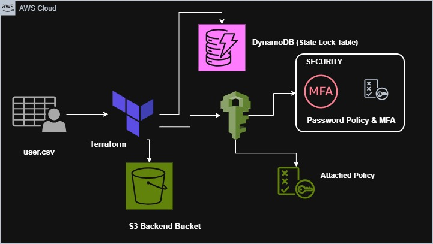

# AWS IAM Automation with Terraform

## Overview
This project automates AWS IAM user provisioning, group-based access control, and security governance using Terraform.

It demonstrates how identity management can be treated as code, making access control reproducible, scalable, and easier to manage.


## About the Project
IAM is often configured manually in many environments, which can lead to inconsistent permissions and access drift over time.

This project implements a structured IAM setup where:
- Users are created from a CSV file
- Access is assigned dynamically based on role attributes
- Governance controls such as password policies and MFA enforcement are managed declaratively

The goal is to build a maintainable and secure IAM architecture using Infrastructure as Code principles.

## Features
- CSV-driven IAM user provisioning
- Dynamic group assignment using Terraform locals
- Role-Based Access Control (RBAC)
- Managed and custom IAM policy attachments
- Account-wide password policy enforcement
- MFA enforcement for privileged users
- Remote Terraform state using S3
- DynamoDB state locking to prevent concurrent updates

## Tech Stack
- Terraform - Infrastructure as Code
- AWS IAM - Identity and Access Management
- Amazon S3 - Remote state storage
- Amazon DynamoDB - Terraform state locking
- AWS CLI - Credential configuration and access

## Project Structure
```
terraform/
├── backend.tf
├── provider.tf
├── versions.tf
├── main.tf
├── locals.tf
├── groups.tf
├── policies.tf
├── mfaPolicy.tf
├── passwordpolicy.tf
├── users.csv
```

File responsibilities:
- main.tf - IAM user creation logic
- locals.tf - Dynamic filtering for group membership
- groups.tf - IAM groups and policy attachments
- policies.tf - Custom EC2 policy
- mfaPolicy.tf - MFA enforcement policy
- passwordpolicy.tf - Account-wide password policy
- backend.tf - Remote backend configuration

## What This Project Does
- Reads user data from users.csv
- Creates IAM users dynamically using for_each
- Applies structured tags (Department, JobTitle, Email, EmployeeID)
- Assigns users to groups based on tag attributes
- Attaches managed or custom policies per group
- Enforces password complexity at the account level
- Requires MFA for privileged users
- Stores Terraform state in S3 with DynamoDB locking

This ensures user onboarding, access control, and governance are automated and consistent.

## Prerequisites
- AWS account with IAM administrative permissions
- Terraform v1.0 or later
- AWS CLI configured with valid credentials
- An S3 bucket for remote state storage
- A DynamoDB table for Terraform state locking

## How to Clone and Run
Clone the repository:
```
git clone https://github.com/Amitkushwaha7/AWS-IAM-User-Management-with-Terraform.git
```

Go to the Terraform folder:
```
cd AWS-IAM-User-Management-with-Terraform/terraform
```

Initialize Terraform:
```
terraform init
```

Preview the infrastructure changes:
```
terraform plan
```

Apply the configuration:
```
terraform apply
```

You can customize the project by modifying:
- users.csv for user definitions
- locals.tf for group logic
- policies.tf for custom access controls

## State Management
Terraform state is stored remotely in S3 with DynamoDB state locking.

This prevents concurrent applies and supports safe, collaborative workflows.

## Conclusion
This project demonstrates how IAM provisioning and governance can be managed through Infrastructure as Code, improving scalability, consistency, and security across environments.

